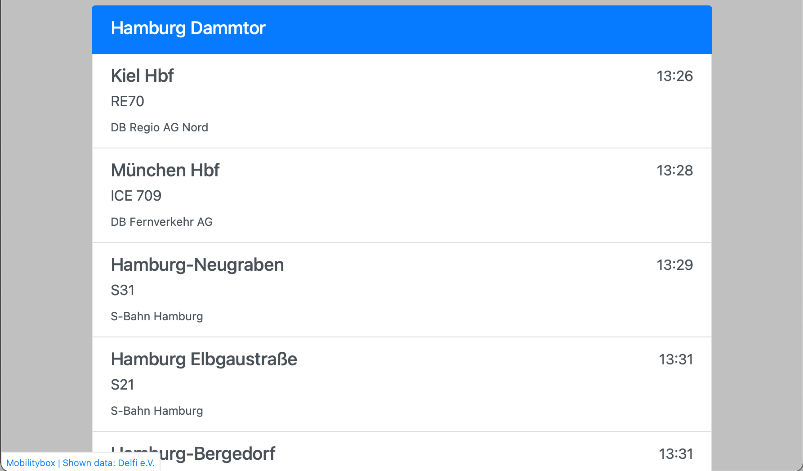

# Mobilitybox.js [](https://app.circleci.com/pipelines/github/themobilitybox/mobilitybox-js)[](https://codecov.io/gh/themobilitybox/mobilitybox-js)[](https://www.npmjs.com/package/mobilitybox)

A fast and easy to use wrapper for [the Mobilitybox](https://themobilitybox.com/). Get scheduling data at ease.

- [Live Demo](https://developer.themobilitybox.com/examples/1/code)
- [Code Examples (including Departures, Live-Data, Trip-Pearl-String, Search-Near-User)](https://developer.themobilitybox.com/examples)

[](https://developer.themobilitybox.com/examples/1/code)

### Projects based on Mobilitybox

- [BrandenGo](https://brandengo.de) Smart departure monitors in Brandenburg, Germany.
- [Duisburg | RealTimeBus](https://duisburg.vesputi.com/app) Live-Position of all busses, trams and trains in Duisburg, Germany.

## Example

```js
const { Mobilitybox } = require('mobilitybox');

const mobilitybox_access_token = 'hallo_welt123';
const mobilitybox = new Mobilitybox(mobilitybox_access_token);
mobilitybox.get_attributions().then((attributions)=>{
  console.log('Attributions: '+attributions.text);
})

mobilitybox.find_stations_by_name({ query: "Hamburg-Dammtor" }, (stations)=>{
  var station = stations[0];

  console.log('Next Departures for Station: '+station.name);

  station.get_next_departures((departures)=>{
    departures.map((departure)=>{
      console.log(
        " - ",
        departure.departure_time.scheduled_at_formatted(),
        departure.line_name,
        departure.headsign  
      )
    })
  });
});
```

## Install

Install with NPM (`npm install mobilitybox`) or Yarn (`yarn add mobilitybox`), then:

```js
// import as an ES module
import { Mobilitybox } from 'mobilitybox';

// or require in Node / Browserify
const { Mobilitybox } = require('mobilitybox');
```

Or use a browser build directly:

```html
<script src="https://unpkg.com/mobilitybox/dist/mobilitybox.min.js"></script> <!-- minified build -->
<script src="https://unpkg.com/mobilitybox/dist/mobilitybox.js"></script> <!-- dev build -->

window.Mobilitybox()
```

## API Reference

### Mobilitybox | Base object

#### new Mobilitybox(access_token, [base_url])

Base object for the Mobility framework.
- *access_token* | is the code needed for accessing the API. (Create one at: https://developer.themobilitybox.com/dashboard/tokens)
- *base_url* (optional) | if you choose to use an other API endpoint feel free. (DEFAULT: `https://api.themobilitybox.com/v1`)

#### Mobilitybox.find_stations_by_name({ query, longitude, latitude })

Station search by name, optionally be also favoring stations close the location at (longitude, latitude). Returns with a list of *MobilityboxStation* objects.
- *query* | a string to search for
- *longitude* | (optional) prioritise results around this location (usefull for finding something like the closest main station to the user)
- *latitude* | (optional) prioritise results around this location (usefull for finding something like the closest main station to the user)

#### Mobilitybox.find_stations_by_position({longitude, latitude})

Station search by a Geo-Position. Returns with a list of *MobilityboxStation* objects.
- *longitude* | an object in Format `{latitude: 52.123, longitude: 13.123}` (Coordinates are floats in degree in WGS84)
- *latitude* | an object in Format `{latitude: 52.123, longitude: 13.123}` (Coordinates are floats in degree in WGS84)

#### Mobilitybox.find_stations_by_id({id, id_type})

Station search by its id. Returns a *MobilityboxStation* object.
- *id* | the id of the station. Usually the start with: `vesputi:station:`
- *id_type* (optional, default: mobilitybox) | you can search also for id from other sources like dhid, delfi or mobilitybox

#### Mobilitybox.get_attributions()
Returns an object including the Attributions suitable for HTML or as text and link.
```json
{
  "html": "&lt;a href='https://www.themobilitybox.com/&apos;&gt;Mobilitybox | Shown data: Delfi e.V.&lt;/a&gt;",
  "text": "Mobilitybox | Shown data: Delfi e.V.",
  "url": "https://www.themobilitybox.com/"
}
```

#### Mobilitybox.get_trip(trip_id)    
returns with a *MobilityboxTrip* object based on its id.

```js
const mobilitybox = new Mobilitybox('abc');
var trip = await mobilitybox.get_trip({id: "vesputi:trip:foobar"})
```

#### Mobilitybox.find_trip_by_characteristics({origins_from_station, destination_station, origins_from_departure_time, destination_arrival_time, [line_name]})    
returns a Promise to a *MobilityboxTrip*.
- *origins_from_station* | *MobilityboxStop* or Identifier of the first station of the trip.
- *destination_station* | *MobilityboxStop* or Identifier of the last station of the trip.
- *origins_from_departure_time* | The departure time on the starting station as unix timestamp in milliseconds or as a *MobilityboxEventTime*
- *destination_arrival_time* | The arrival time on the ending station as unix timestamp in milliseconds or as a *MobilityboxEventTime*
- *line_name* | (optional) The short name of the corresponding line


```js
const mobilitybox = new Mobilitybox('abc');
const origins_from_departure_time = new Date("2021-01-01T12:00:00").getTime();
const destination_arrival_time = new Date("2021-01-01T13:00:00").getTime();

var trip = await mobilitybox.get_trip({origins_from_station: "vesputi:station:1234", destination_station: "vesputi:station:5678", origins_from_departure_time: origins_from_departure_time, destination_arrival_time: destination_arrival_time, line_name: "foobar"})
```

#### Mobilitybox.build_station(station_data)
This creates a new `MobilityboxStation` object based on the given data without making a network request.
This is espacially useful when taking station_data from outside the framework like from an object on a map.


```js
const mobilitybox = new Mobilitybox('abc');
var station = mobilitybox.build_station({
  name: "a_station_name",
  id: "a_station_id",
  position: {
    latitude: 1.2345,
    longitude: 1.2345
  }
})
```

#### Mobilitybox.vector_tile_source() [DEPRECATED]

This method is deprecated, please use ```Mobilitybox.station_map_vector_tile_source()```. The old method will be removed with version 4.0

In order to show stations and platforms on a map it is usefull to transfer them as map tiles. (Gives you only the currently displayed stations.)
This returns a Mapbox compatible structure to set a source of these tiles including its urls (may be multiple for load-distribution).

You can access the urls only by refering to `mobilitybox.vector_tile_source().tiles`.

- [API Description](https://developer.themobilitybox.com/documentation/api#/Map/get_map_tiles__zoom_level___x___y__mvt)
- [Vector Tile Spec](https://github.com/mapbox/vector-tile-spec)
- [Add a Vector Tile Source to mapbox](https://docs.mapbox.com/mapbox-gl-js/example/vector-source/)

#### Mobilitybox.station_map_vector_tile_source()

In order to show stations and platforms on a map it is usefull to transfer them as map tiles. (Gives you only the currently displayed stations.)
This returns a Mapbox compatible structure to set a source of these tiles including its urls (may be multiple for load-distribution).

You can access the urls only by refering to `mobilitybox.station_map_vector_tile_source().tiles`.

- [API Description](https://developer.themobilitybox.com/documentation/api#/Map/get_station_map__zoom_level___x___y__mvt)
- [Vector Tile Spec](https://github.com/mapbox/vector-tile-spec)
- [Add a Vector Tile Source to mapbox](https://docs.mapbox.com/mapbox-gl-js/example/vector-source/)

```js
mapbox_map.addSource('station_tiles', window.mobilitybox.station_map_vector_tile_source())
```

#### Mobilitybox.relevant_routes_vector_tile_source() [DEPRECATED]

This method is deprecated, please use ```Mobilitybox.transit_map_vector_tile_source()```. The old method will be removed with version 4.0

In order to show relevant routes on a map it is usefull to transfer them as map tiles. (Gives you only the currently displayed segments.)
This returns a Mapbox compatible structure to set a source of these tiles including its urls (may be multiple for load-distribution).

You can access the urls only by refering to `mobilitybox.relevant_routes_vector_tile_source().tiles`.

- [API Description](https://developer.themobilitybox.com/documentation/api#/Map/get_relevant_routes_map_tiles__zoom_level___x___y__mvt)
- [Vector Tile Spec](https://github.com/mapbox/vector-tile-spec)
- [Add a Vector Tile Source to mapbox](https://docs.mapbox.com/mapbox-gl-js/example/vector-source/)

```js
mapbox_map.addSource('relevant_route_tiles', window.mobilitybox.relevant_routes_vector_tile_source())
```

#### Mobilitybox.transit_map_vector_tile_source()
(DEPRECATED: Mobilitybox.relevant_routes_vector_tile_source())

The transit map layer is a set of lines on a map which represent the typical routes public transit vehicles take. This includes for example buses, trams and subways. This transit map layer might show routes of different importance on different zoom levels.
This returns a Mapbox compatible structure to set a source of these tiles including its urls (may be multiple for load-distribution).

You can access the urls only by refering to `mobilitybox.transit_map_vector_tile_source().tiles`.

- [API Description](https://developer.themobilitybox.com/documentation/api#/Map/get_transit_map__zoom_level___x___y__mvt)
- [Vector Tile Spec](https://github.com/mapbox/vector-tile-spec)
- [Add a Vector Tile Source to mapbox](https://docs.mapbox.com/mapbox-gl-js/example/vector-source/)

```js
mapbox_map.addSource('transit_map_segments', window.mobilitybox.transit_map_vector_tile_source())
```

### CancablePromise | You can stop requests
All Promises returned are cancable. You can stop each promise. After `cancel()`, the promise is never resolved.
This is espacially usefull if you are loading departures on a station, but the user decides to select another station. So you can cancel the promise and go on.
(Details on Github: [CancelablePromise](https://github.com/alkemics/CancelablePromise#readme))

```js
const request = station.get_next_departures().then((departures)=>{
  console.log(departure.headsign); //This will not be executed
})

request.cancel()
```

### MobilityboxStation | A Station object

### MobilityboxDeparture | A departure of a trip on a station

#### Attributes
- `headsign` - *string* | The direction as indicated on the vehicle. Usually the final station. //e.g. "Hogsmead"
- `line_name` - *string* | Name of the Line given by its authority //e.g. "5972"
- `type` - *object* | Kind and Product helpful to differentiate trams and busses
  - TODO: Document the possible types {kind	string, product	string }
- `provider` - *string* | Authority of the trip. //e.g. "Hogwarts Express Railway Authorities"
- `platform` - *string* | Platform name if  //e.g. "9 3/4" can be `null` if none is given
- `departure_time` *MobilityboxEventTime* | The time referencing the departure. With prediction and scheduled time. (Prediction can be null if none is given.)
- `mobilitybox` // *Mobilitybox* | The underlying Mobilitybox object

#### Methods
- none

#### Example
```js
mobilitybox.find_stations_by_name({ query: "Hamburg-Dammtor" }).then((stations)=>{
  var station = stations[0];

  console.log('Next Departures for Station: '+station.name);

  station.get_next_departures((departures)=>{
    departures.map((departure)=>{
      console.log(
        " - ",
        departure.departure_time.scheduled_at_formatted(),
        departure.line_name,
        departure.headsign  
      )
    })
  });
});
```

### MobilityboxTrip | A Trip object
A trip is a journey of a vehicle at a point in time. It starts somewhere, ends somewhere and stops multiple times in between.

#### Attributes
- `name` - *string* | The name of the Trip
  - TODO: Document what the name of a trip is.
- `stops`- *array* | An ordered list of all stops as `MobilityboxStop` on this trip. Including its station, departure and arrival times.
- `id` - *string* | An unique identifier for this trip. Its value might not be stable in future API versions. It is stable over multiple timetable updates, if the trip doesn't change.
- `geojson`- *object* | MultiLineString GeoJSON. It contains a List of Linestrings, where each of them describes a path of between a pair of stops of the trip.
- `mobilitybox` // *Mobilitybox* | The underlying Mobilitybox object

#### Methods
- `date_formatted()` - returns the date of the trip in a german human readable form. e.g. "13.2.2020" If the trip runs over multiple days, it gives you both days. e.g. "13.2.2020 - 14.2.2020"
- `origins_from()` - returns the starting station of the trip as `MobilityboxStation`
- `destination()` - returns the last station of the trip as `MobilityboxStation`


### MobilityboxEventTime | A wrapper for easy use of time
An event time is used for departure times and also arrival times, it consists of actually two time-stamps. A `scheduled_at` and a `predicted_at` time, because they might differ. Usually used on departure objects: `departure.departure_time`

#### Attributes
- `scheduled_at` - *Date* | The date object of the time when the departure/arrival is supposed to happen. Is `null` if no time was given (this would be very unusual).
- `predicted_at` - *Date* | The date object of the time when the departure/arrival will probable to happen. (As usually calculated by the control-room-software by knowing the vehicles current position.)  Is `null` if there is no prediction (predictions usually are only given a few minutes before departure/arrival time. So if you pull new data that might change.).

#### Methods
- `scheduled_at_formatted()` - *String* | Gives you the scheduled time as a formatted string in german style. e.g. "8:06". Returns `null` if time is not set (this would be very unusual).
- `predicted_at_formatted()` - *String* | Gives you the predicted time as a formatted string in german style. e.g. "8:06". Returns `null` if time is not set (predictions usually are only given a few minutes before departure/arrival time. So if you pull new data that might change.).
- `scheduled_at_date_formatted()` - *String* | Gives you the date as it is scheduled as a formatted string in german style. e.g. "18.2.2021". Returns `null` if time is not set (this would be very unusual).
- `predicted_at_date_formatted()` - *String* | Gives you the date as it is predicted (usually this is the same date as scheduled, but it might differ, espacially late in the day.) a formatted string in german style. e.g. "18.2.2021". Returns `null` if time is not set.

#### Example
```js
station.get_next_departures().then((departures)=>{
  departures.map((departure)=>{
    console.log(
      departure.departure_time.scheduled_at_formatted(),
      departure.departure_time.predicted_at_formatted()
    )
  });
});
```

### MobilityboxStop | Combination of Station and Time
An aggregation object that is describing a vehicle arriving and departuring at a specific time on a specific station.

#### Attributes

- `station` - *MobilityboxStation* | The station on wich the vehicle stops.
- `status`- *string* | TODO: Document what the status can be
- `arrival` // *MobilityboxEventTime* | Time when the vehicle will come to the station. It might be an MobilityboxEventTime where the values are null if it is the first station on the trip or the information is unclear (sometimes this is not given for stations where a train waits a long time).
- `departure` - *MobilityboxEventTime* | Time when the vehicle will leave the station. It might be an MobilityboxEventTime where the values are null if it is the last station on the trip (sometimes this is not given for stations where people are not meant to enter a train).

#### Methods
- none
